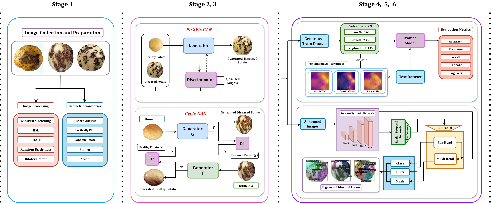
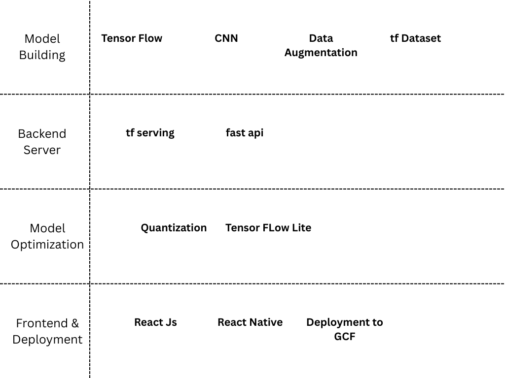

# PotatoGANs: Utilizing Generative Adversarial Networks, Instance Segmentation, and Explainable AI for Enhanced Potato Disease Identification and Classification

## Abstract
Deep learning has enabled automated agricultural disease segmentation, but overfitting in new conditions remains a challenge. In potato farming, where disease detection is vital for yield, traditional data augmentation (e.g., rotation, flip) often fails to ensure generalization. To address this, we propose PotatoGANs, a novel method using two GAN models (CycleGAN and Pix2Pix) to generate synthetic disease images from healthy potato images. This enhances dataset diversity and improves model generalization. CycleGAN outperforms Pix2Pix, achieving higher Inception Scores (1.2001 for black scurf, 1.0900 for common scab). We also integrate three Explainable AI techniques (GradCAM, GradCAM++, ScoreCAM) with CNNs (DenseNet169, ResNet152 V2, InceptionResNet V2) for better interpretability. Using the augmented data with Detectron2 and a ResNeXt-101 backbone, we achieve a dice score of 0.8112 for disease segmentation. This combined approach improves accuracy, robustness, and interpretability over traditional methods.

## Table of Contents
- [Proposed Methodology](#experimental-methodology)
- [Experimental Setups](#experimental-setups)
- [Dataset Availability](#dataset-availability)
- [Results](#results)
- [Contact Information](#contact-information)

## Proposed Methodology

## Experimental Setups

### Setup 1: Kaggle
- **Environment:**
  - Python Version: 3.11
  - PyTorch Version: 2.1.0
  - GPU: T4 GPU with 7.5 Compute Capability
  - RAM: 30 GB

### Setup 2: Jupyter Notebook Environment
- **Environment:**
  - Python Version: 3.10.12
  - PyTorch Version: 2.1.0
  - GPU: NVIDIA GeForce RTX 3050 (8 GB)
  - RAM: 16 GB
  - Storage: 512 GB NVMe SSD

### Setup 3: Jupyter Notebook Environment
- **Environment:**
  - Python Version: 3.10.12
  - Tensforflow Version: 2.6.0
  - GPU: NVIDIA GeForce RTX 3050 (8 GB)
  - RAM: 16 GB
  - Storage: 512 GB NVMe SSD
    
## Dataset Availability

The Comprehensive Potato Disease Dataset is now publicly accessible! This dataset, available in both jpg and png formats, offers a valuable resource for diverse research and analysis purposes. You can explore and download the dataset at the following link: [Dataset](https://github.com/Wasi34/Comprehensive-Potato-Disease-Dataset). Feel free to utilize this resource for your research, experiments, or any analytical endeavors. Should you have any questions or require further assistance with the dataset, please don't hesitate to reach out.

## Proposed Methodology

## Configuration Table

## Results
### Generated Potato Disease Realistic Image Evaluation Using Frechet Inception Distance and Inception Score

| **Class**      | **GANs**       | **Frechet Inception Distance** | **Inception Score** |
|----------------|----------------|--------------------------------|---------------------|
| Black Scurf    | Cycle GAN      | 0.4028                         | 1.2001              |
|                | Pix2Pix GAN    | 0.5743                         | 0.9899              |
| Common Scab    | Cycle GAN      | 0.4882                         | 1.0900              |
|                | Pix2Pix GAN    | 0.6240                         | 0.9643              |

### Performance Evaluation of Pretrained CNN for Potato Disease Classification

| **Model**            | **Accuracy** | **Precision** | **Recall** | **F1 Score** | **Log Loss** |
|----------------------|--------------|---------------|------------|--------------|--------------|
| DenseNet169         | 1.0000       | 1.0000        | 1.0000     | 1.0000       | 0.0024       |
| Resnet152V2         | 0.9804       | 0.9792        | 0.9821     | 0.9803       | 0.7067       |
| InceptionResNetV2   | 0.9902       | 0.9912        | 0.9891     | 0.9901       | 0.3533       |

### Performance Evaluation of Potato Disease Instance Segmentation

| **Backbone** | **Task Type** | **AP** | **\(AP_{IoU= 0.5}\)** | **\(AP_{IoU= 0.75}\)** | **Dice Score** |
|--------------|---------------|--------|-------------------------|-------------------------|----------------|
| ResNet-50    | Segmentation  | 73.204 | 89.733                  | 86.126                  | 0.6014         |
|              | Bounding Box  | 83.824 | 90.526                  | 86.353                  |                |
|--------------|---------------|--------|-------------------------|-------------------------|----------------|
| ResNet-101   | Segmentation  | 78.681 | 92.905                  | 74.851                  | 0.6728         |
|              | Bounding Box  | 87.886 | 96.409                  | 90.943                  |                |
|--------------|---------------|--------|-------------------------|-------------------------|----------------|
| ResNeXt-101  | Segmentation  | 86.039 | 97.030                  | 96.040                  | 0.8112         |
|              | Bounding Box  | 97.030 | 97.030                  | 97.030                  |                |

## Future Work
We aim to extend PotatoGANs into a scalable, cloud-based solution for real-time disease detection via mobile and web apps. Planned enhancements include:
- **Google Cloud Functions Deployment:**
  - The inference pipeline will be deployed as a RESTful API using Google Cloud Functions to serve predictions on demand.
- **Mobile and Web App Integration:**
  - Applications will interact with the backend through secure API calls, utilizing Firebase for authentication and user management.

- **Model Optimization for Cloud Inference:**
  - Models will be converted to lightweight formats such as TensorFlow Lite or ONNX to improve inference speed and reduce computational load.

- **Cloud-based Image Preprocessing:**
  - Image normalization and resizing will be handled server-side to ensure consistent input quality across devices.

- **Monitoring and Logging:**
  - nIntegration with Google Cloud Logging and Monitoring will help track usage patterns, response times, and failure rates.

- **Scalable Deployment via Cloud Run:**
  - nFor large models like Detectron2, Docker-based deployment on Google Cloud Run will be considered to overcome Cloud Functions' limitations.

- **API Security and Rate Limiting:**
  - nAuthentication mechanisms and usage quotas will be implemented using Firebase Auth or API Gateway to prevent abuse.

- **Cloud Storage Integration:**
Uploaded images and model outputs, such as segmentation masks and GradCAM visualizations, will be stored in Google Cloud Storage for traceability and analysis.

## Contact Information

For any questions, collaboration opportunities, or further inquiries, please feel free to reach out:

- **Radhika Singhal**
  - Email: [radhika.singhal0712@gmail.com](mailto:radhika.singhal0712@gmail.com)

    
